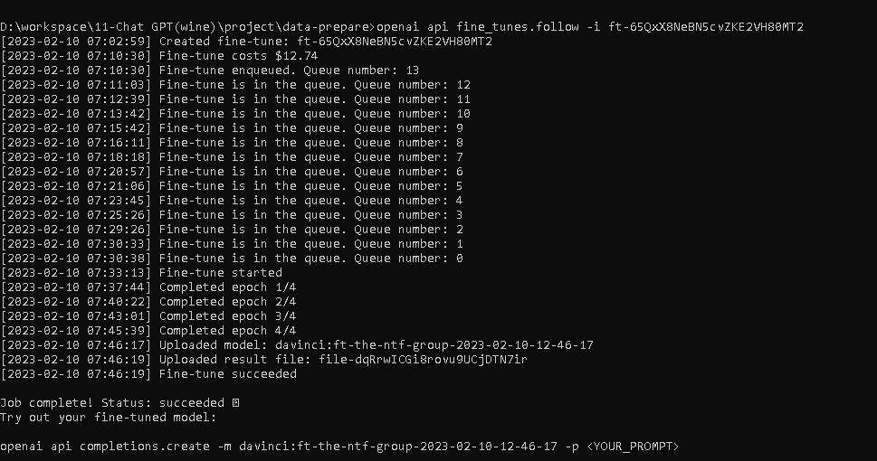

# Wine Service(ChatGPT Data Prepare)

> Prepare datasets for fine-tuning.

## Table of Contents

- [General Info](#general-information)
- [Technologies Used](#technologies-used)
- [Features](#features)
- [Screenshots](#screenshots)
- [Setup](#setup)
- [Project Status](#project-status)
- [Room for Improvement](#room-for-improvement)
- [Acknowledgements](#acknowledgements)
- [Contact](#contact)

## General Information

- Prepare dataset for fine-tuning.
- Training wine shop's own wine database.
- Quality of prompt & completion pair.
- To skill up data processing.

## Technologies Used

- Tech 1 - Node.js
- Tech 2 - read-excel-file/node
- Tech 3 - fine-tune terminals

## Features

List the ready features here:

- Xlsx Reader
- Generate jsonl for fine-tuning.

## Screenshots

## Setup

Requires Node.js to be installed.\
Run `npm install` to install node_modules before setup.\

## Project Status

Project is: _in progress_

## Room for Improvement

These are areas i believe need improvement / could be improved. Also added TODOs for future development.

Room for improvement:

- Data process
- OpenAI Fine-Tuning
- Node.js modules

To do:

- Quality of dataset
- Customize Fine-Tuning

## Acknowledgements

- This project was inspired by Valentyn.
- This project was based on [this tutorial](https://platform.openai.com/docs/guides/fine-tuning).
- Many thanks to Valentyn.

## Contact

Created by [Bohdan](https://softdev629.github.io) - feel free to contact me!
